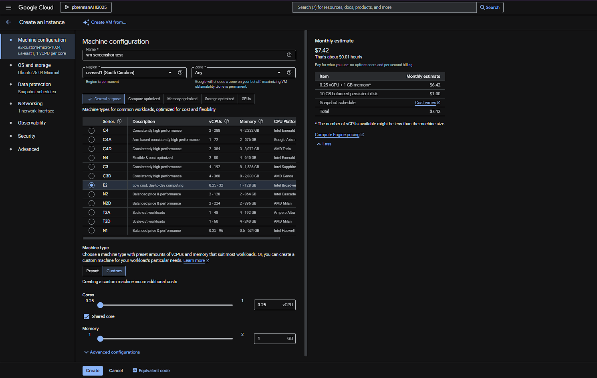
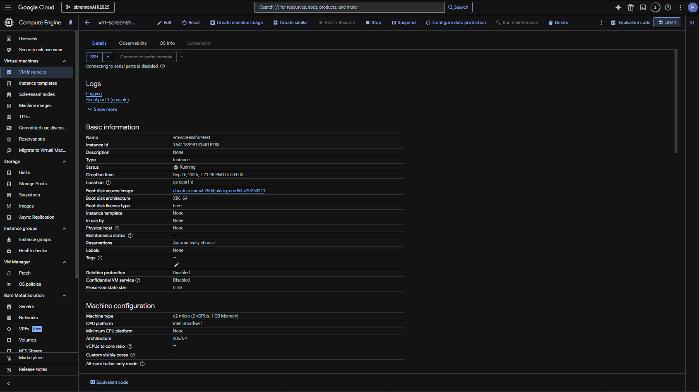
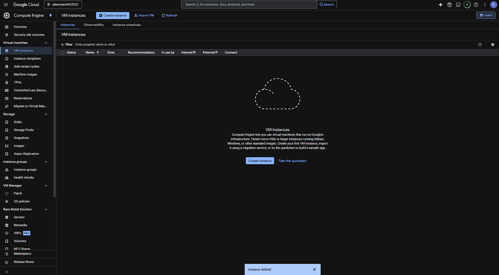
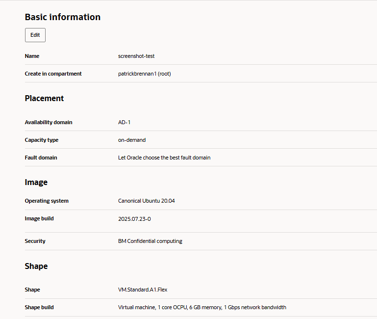
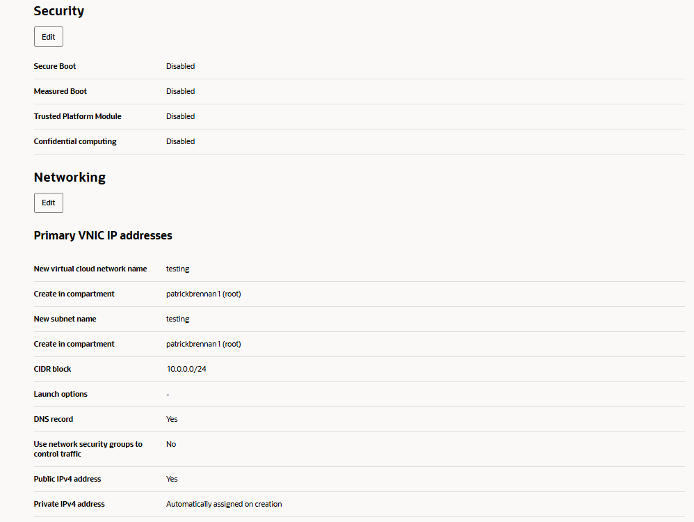
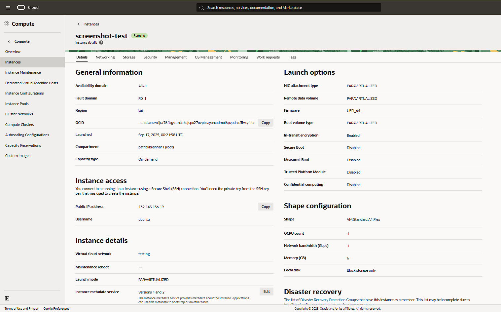
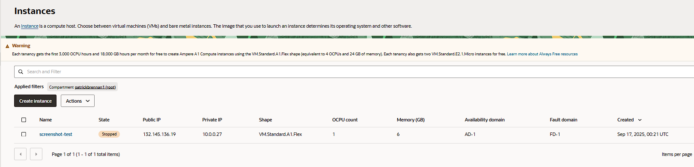
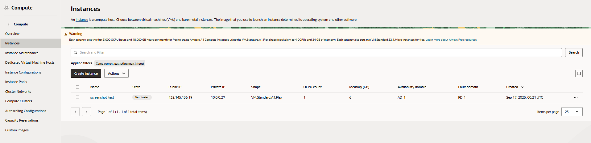

# Tutorial Videos

## Google Cloud
https://www.loom.com/share/a4c82be41b534df7bd49aaf24aca72c1?sid=901b9262-f268-4d63-a9a9-8a80e3edff08

## Oracle
https://www.loom.com/share/791d2242275046beb9b2a1ba6bc459c9?sid=59e9da95-02c8-444b-b16d-12d09142c0de

# VM Lifecycle on GCP and OCI — Tutorial
## Google Cloud (GCP)
### Create
1. Console → Compute Engine → Create instance
2. Region/zone: us-east1 (South Carolina)
3. Machine type: e2-micro (0.25 vCPU + 1 GB memory)
4. Image: Ubuntu LTS
5. Boot disk: default minimal
6. Network: default VPC; ephemeral public IP

### Start/Stop
- Start: <state shows RUNNING>

- Stop: <state shows STOPPED>

### Delete
- Delete instance and verify no disks/IPs remain

---

## Oracle Cloud (OCI)
### Create
1. Compartment: patrickbrennan1 (root), 504
2. Networking: VCN with Internet Connectivity (defaults)
3. Shape: VM.Standard.E2.1.Micro
   Virtual Machine, 1 core OCPU, 6 GB memory, 1 Gbps network bandwith
5. Image: Ubuntu (or Oracle Linux)
6. Public IP: ephemeral
7. Boot volume: default minimal

### Start/Stop
- Start: <state shows RUNNING>

- Stop: <state shows STOPPED>

### Terminate
- Terminate and delete boot volume; verify cleanup

---

## Reflections
### Similarities
- Projects on Google is somewhat similar to the compartments on Oracle
- Similar seperation of sections (machine setup, security, network)
- Options for images were very similar
- Straight forward stopping and termination
- Both took a bit of time to stop and terminate the machine

### Differences
- More options for machine type on Google
- Free options on Oracle, none on google
- Google alowed more free movement
- Network process on Oracle was more rigid
- Oracle provided full review at the end, Google had short review listed on the right
- Drop down menu to stop and terminate on Oracle
- Once terminated, machine on Google completely gone, still listed on Oracle

### Preference (OCI vs GCP) and Why
- I prefer the GCP processes, starting with the ease of access when starting the process. When it came to making the virtual machine, I thought that the process for Google was smoother (possibly because we ent over it in class). The Google set-up allowed you to jump between sections as needed while Oracle forced you to go through each section in a linear style. On top of this, the network section of the Oracle virtual machine set-up did result in errors and the virtual cloud network requirement was slightly confusing. The one benefit of Oracle is the complete review screen of the machine set-up. Once the machine was up and running, Google also made it slightly easier to stop and terminate since the buttons were directly on top. Meanwhile, Oracle required finding a drop down menu which is only a minor issue. Finally, once the virtual machine was terminated, Google had it completely disappear, which made less clutter than Oracle, which left the machine listed with "Terminate".
